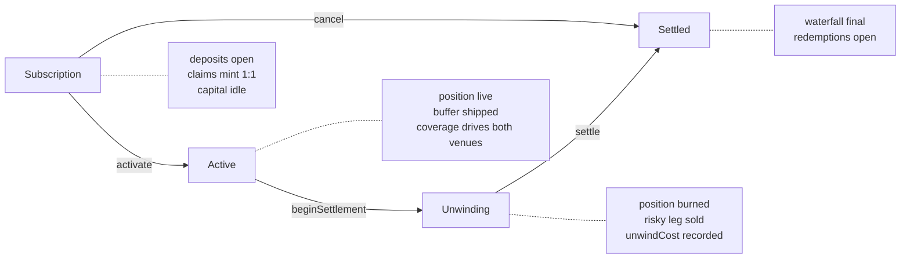
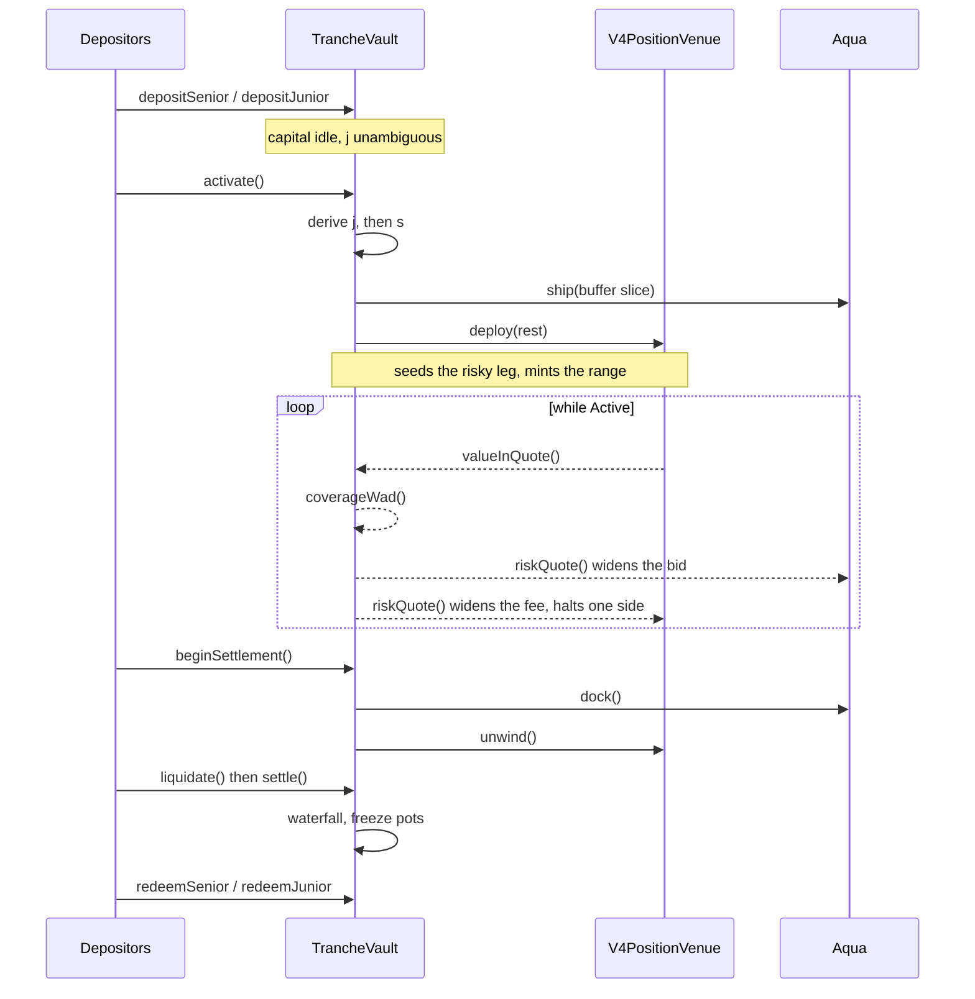
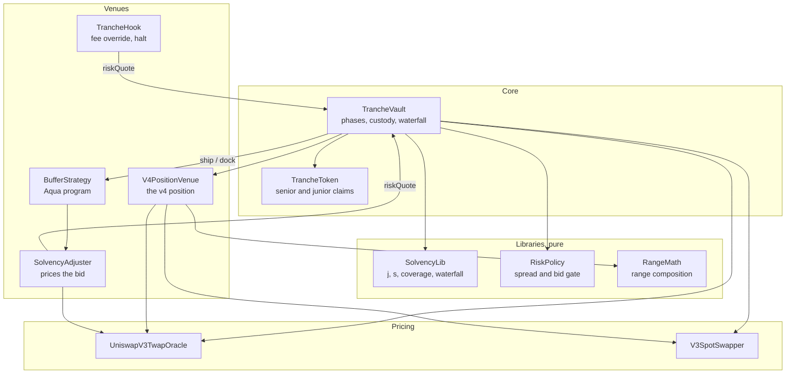

# Trelp

Trelp splits one Uniswap v4 liquidity position into two tradeable claims. Senior takes a capped
claim paid first. Junior takes the first loss and keeps everything left over.

One pool position, two risk profiles, one settlement.

## The problem

Providing liquidity gives you one undifferentiated payoff. You earn fees, you eat impermanent loss
and adverse selection, and the net is uncertain. There is no way to buy only the steady part or
only the levered part.

That pushes two groups out of the market. Capital that wants predictable yield will not accept a
position that can be down 20% because the pair moved. Capital that wants leveraged exposure to
fee income has to go borrow it somewhere else.

Both sides want the same position. They want different slices of it.

## The solution

### Payment order, not loss attribution

At settlement the vault holds one number: the quote balance after the position is unwound. Senior
is paid first up to its claim, junior takes the remainder.

```
seniorPayout = min(NAV, seniorClaim)
juniorPayout = NAV - seniorPayout
```

Nothing is transferred between tranches. Junior absorbs losses by being paid second.

This is why the protocol never computes impermanent loss. IL, fees, unwind cost, and adverse
selection are already inside that single NAV. Attributing them per user would need path dependent
accounting and a counterfactual price oracle, and would change nobody's payout.

### Terms derived from realised demand

Senior's share of the upside is not configured. It is derived at activation from the subordination
ratio that actually turned up:

```
j = J0 / (S0 + J0)          junior's share of capital
s = lambda * (1 - 2j) / (1 - j)   senior's share of net gain
```

Requiring junior to beat an unlevered LP at any fee yield makes the fee term cancel, so the bound
holds regardless of how the epoch performs. It also returns zero at j >= 50%, so the point where
tranching stops being worth doing is arithmetic rather than a hand-set guard.

Senior's settled claim is `S0 + min(S0 * c, s * max(0, NAV - V0))`. The coupon is capped, and in a
losing epoch it is zero.

### One solvency signal, read by every venue

```
b = (NAV - seniorClaim) / seniorClaim
```

Coverage is signed, so it can go negative. Both trading venues read it from the same vault and
price off it. As coverage falls the spread widens, then the risk increasing side is refused
outright. The position defends itself as it degrades instead of quoting the same way into a
drawdown.

### A hook that can say no

A Uniswap v4 hook gates the pool to the vault's own position, overrides the LP fee from the
coverage spread, and refuses swaps that would push more of the falling asset onto the vault.

A dynamic fee is symmetric and cannot skew, so a directional refusal is the only way to keep
quoting the side that reduces risk while declining the side that increases it.

### A buffer that does not leave the vault

Part of junior's capital is shipped to 1inch Aqua as a standing bid below spot. Aqua takes no
custody, so the capital stays in the vault, still counted by `nav()`, still absorbing losses, while
also being a live order. When coverage breaches the threshold anyone can call `callBuffer()` and
revoke it, turning the cushion back into pure loss absorption.

### Honest about the limit

Junior is a cushion, not a guarantee. A large enough drawdown exhausts junior and reaches senior.
Running the full lifecycle against mainnet state:

| ETH | NAV | Coverage | Spread | Bidding |
|---|---|---|---|---|
| 2489 | 1,000,000 | 4285 bps | 30 bps | yes |
| -10% | 954,797 | 3630 bps | 39 bps | yes |
| -20% | 893,619 | 2757 bps | 51 bps | yes |
| -32% | 794,467 | 1341 bps | 71 bps | yes |
| -45% | 669,677 | -439 bps | 90 bps | no |

Settled at 671,439 against a senior claim of 700,000. Junior wiped, senior down 4.08%.

## Lifecycle

One deployment runs one epoch and terminates. Rolling is a new deployment, which removes all cross
epoch accounting.



There is no entry or exit during `Active`. The senior coupon is only quotable against a known `j`,
and redeeming at NAV mid drawdown would let junior leave before absorbing the loss it exists to
absorb. Claims are ERC-20, so the secondary market is the exit.

What happens at each transition:



## Contract modules

The vault is the only contract that holds funds. Everything else is either pure accounting or a
venue reached through an interface.



| Module | Role |
|---|---|
| `TrancheVault` | Phases, deposits, the waterfall, the only contract holding funds |
| `SolvencyLib` | Every settled number: `j`, `s`, accrual, coverage, waterfall |
| `RiskPolicy` | Turns coverage into a spread and a bid gate |
| `RangeMath` | Range composition and the exposed bound |
| `V4PositionVenue` | Holds the v4 position, enforces the range covenant |
| `TrancheHook` | Gates liquidity, overrides the fee, refuses one direction |
| `BufferStrategy` | Composes the Aqua program for the standing bid |
| `SolvencyAdjuster` | Anchors that bid to the oracle and widens it with distress |
| `UniswapV3TwapOracle` | The mark that coverage, the breaker and the floor all read |
| `V3SpotSwapper` | Converts between the two assets at both ends of the epoch |

Three things hold this together.

**`SolvencyLib` is the single source of truth.** Onchain settlement and offchain projection read the
same functions, so the pitch and the payout cannot drift.

**Venues sit behind interfaces.** `IPositionVenue` and `IBufferStrategy` mean the vault never
imports Uniswap or Aqua types. That is what lets the two coexist: v4-core pins solc 0.8.26 and
Aqua pins 0.8.30, so no single file can name both concretely.

**Both venues read one policy.** `TrancheHook` and `SolvencyAdjuster` call the same `riskQuote()` on
the same vault. There is one risk view, applied in two places.

## Run it

```bash
corepack pnpm install
corepack pnpm dev          # product at http://localhost:3000
forge test --root contracts
```

The full stack against forked mainnet, real v4 and real Aqua:

```bash
MAINNET_RPC_URL=<rpc> forge test --root contracts --match-path test/fork
```

Live deployment addresses are in [contracts/deployments](./contracts/deployments). Frontend
configuration is in [apps/web/.env.example](./apps/web/.env.example). Protocol detail is in
[contracts/README.md](./contracts/README.md).

## Conclusion

Tranching credit is old. Tranching a liquidity position is harder, because the underlying has a
loss term and not just variable income. Trelp handles that by settling on one NAV and ordering the
claims against it, deriving senior's terms from demand that actually showed up, and giving both
venues a single solvency signal they are required to price off.

What is not built: no fee level interest waterfall, so senior's coupon is contingent on the epoch
making money. No hedge during a drawdown. One position per vault. Those are the next things.

## Attribution

Powered by Aqua, copyright Degensoft Ltd 2025.

1inch Aqua and SwapVM are source-available under the Degensoft licences, not open source. Code in
`contracts/src/aqua/` is a Modification under section 3.1 and carries
`LicenseRef-Degensoft-SwapVM-1.1`. The rest of `contracts/src/` calls Aqua only through a hand
written interface and stays MIT. See
[contracts/src/aqua/LICENSE-NOTE.md](./contracts/src/aqua/LICENSE-NOTE.md).

## Design provenance

- Hero artwork: project-supplied `apps/web/public/trelp-rider-transparent.png`
- Brand marks and token icons: `apps/web/public/brand`, sourced per `brand/asset-sources.json`
- Animation runtime and interaction patterns: [Motion](https://motion.dev)
- Section rhythm references: [Supermemory](https://supermemory.ai) and [Greptile](https://www.greptile.com)
- Decorative graphics and marks: original inline SVGs, no icon library
