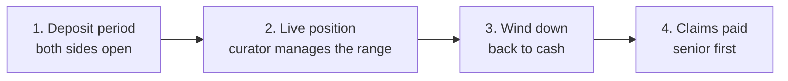
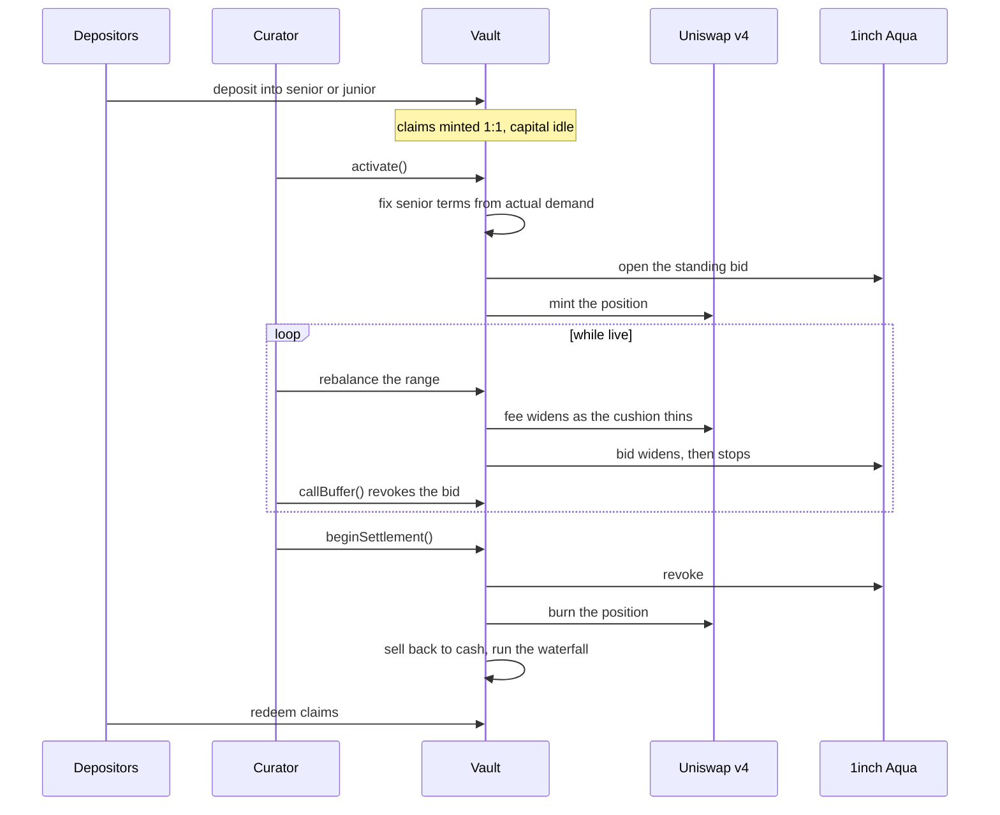
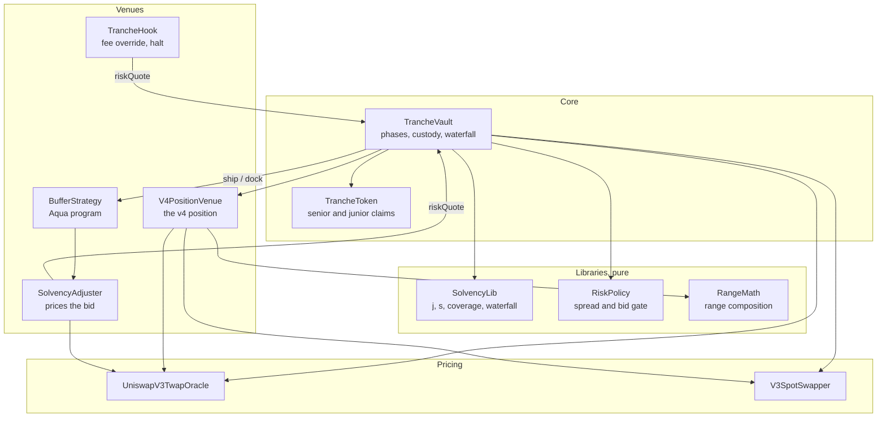

# Trelp

Trelp turns one Uniswap v4 liquidity position into two products. Senior is the safe side: it gets
paid first and earns a capped return. Junior is the levered side: it takes the first loss and keeps
whatever is left after senior is paid.

A curator runs the position. Depositors pick a side.

Underneath, the position lives in a Uniswap v4 pool with a custom hook, and part of junior's
capital works as a standing bid on 1inch Aqua without ever leaving the vault.

## The problem

Being an LP is a single, blended bet. You earn trading fees, you lose money when the pair moves
against you, and you find out the net at the end. You cannot buy just the steady part or just the
levered part.

So two kinds of capital stay out. Treasuries and funds that need predictable yield will not accept
a position that can be down 20% because ETH moved. Traders who want leveraged exposure to fee
income have to borrow it somewhere else and manage that separately.

Both want the same position. They want different slices of it.

## The solution

### Two sides of one position

Deposit into senior and you are first in line at settlement. Your return is capped, and you are
protected by junior's capital sitting underneath you.

Deposit into junior and you absorb losses before senior feels anything. In exchange you keep the
entire upside above senior's capped claim, which means leveraged exposure to how the position
performs.

Both sides hold ERC-20 claim tokens, so a position can be sold before the epoch ends.

### Terms are set by who shows up

Senior's rate is not picked in advance. It is fixed at the moment the deposit period closes, based
on how much of each side actually arrived.

The more junior capital that shows up, the thicker senior's cushion, and the less senior needs to
be paid for the risk. Thin junior means senior is closer to the loss and is priced accordingly.

There is a hard limit built in. Past a certain point there is no rate that leaves both sides better
off than simply LPing on their own, and the vault refuses to start rather than sell terms that do
not work.

### A curator runs the position

Someone has to decide where the liquidity sits. The curator picks the price range at the start and
can move it as the market moves, which is the difference between a position that keeps earning fees
and one that drifts out of range and stops.

Those powers are deliberately narrow. The curator never holds depositor funds, cannot change the
terms once the epoch starts, cannot move the range more often than a cooldown allows, and is
blocked from moving it at all once the position is under stress. Every range move has its cost
measured and recorded, so the discretion shows up in the final numbers instead of hiding in them.

### The position defends itself

Junior's capital is the first line of defence. The second is that the vault watches its own health
continuously and both venues react to it.

**In the Uniswap v4 pool**, a hook prices every swap off that health reading. As the cushion thins
the pool's fee widens automatically. If it gets bad enough the hook refuses trades that would push
more of the falling asset onto the vault, while still accepting trades that reduce risk. A normal
pool has no way to say no, which is exactly how an LP ends up buying all the way down.

**On 1inch Aqua**, part of junior's capital works as a standing bid below the market. Aqua never
takes custody, so that money is still sitting in the vault backing senior while it quotes. It picks
up the asset at a discount in calm markets, widens as the cushion thins, and stops bidding
entirely when things get bad. Anyone can revoke it outright once health crosses the threshold,
turning it back into pure loss absorption.

Both venues read the same number from the same contract. There is one view of risk, applied in two
places.

### Junior is a cushion, not a guarantee

A big enough drawdown eats through junior and reaches senior. Running the full lifecycle against
real mainnet prices:

| ETH price | Vault value | Cushion | Pool fee | Still bidding |
|---|---|---|---|---|
| 2489 | 1,000,000 | 42.9% | 30 bps | yes |
| down 10% | 954,797 | 36.3% | 39 bps | yes |
| down 20% | 893,619 | 27.6% | 51 bps | yes |
| down 32% | 794,467 | 13.4% | 71 bps | yes |
| down 45% | 669,677 | gone | 90 bps | no |

Settled at 671,439 against a senior claim of 700,000. Junior lost everything, senior still finished
down 4.08%. That is the honest shape of the product, and it is what the cushion is sized against.

## Lifecycle

One deployment runs one epoch and ends. Running it again is a new deployment, which keeps the
accounting simple and means no epoch can inherit another one's problems.



### 1. Deposit period

Both tranches are open. Anyone can deposit the quote asset, USDC in our deployment, and receive
senior or junior claim tokens one for one. Nothing is deployed yet, so the split between the two
sides is unambiguous.

### 2. The position goes live

When the deposit window closes, `activate()` does everything at once. It reads how much of each
side arrived, fixes senior's terms from that, opens the Aqua bid with part of junior's capital, and
puts the rest into the Uniswap v4 pool as a concentrated position.

From here the position is live and earning. The curator can move the range as the market moves,
subject to the limits above. The vault continuously recomputes its health, and the pool fee and the
Aqua bid both track it.

Deposits and withdrawals are closed during this phase. Senior's rate was quoted against a specific
amount of junior capital, and letting junior walk out mid drawdown would remove the exact thing
senior was paying for. Claim tokens are transferable, so selling is the exit.

### 3. Wind down

At the end of the epoch the Aqua bid is revoked, the v4 position is burned, and both assets come
back to the vault. Whatever is still held in the volatile asset is sold back to the quote asset,
floored against the oracle so a bad venue cannot be used to settle low.

The cost of that conversion is recorded rather than absorbed silently.

### 4. Claims are paid

The vault takes its final cash balance and runs the waterfall once. Senior is paid up to its claim.
Junior takes everything that remains, which can be zero. Both pools are frozen, and holders redeem
their claim tokens for a proportional share.




## Contract modules

The vault is the only contract that holds funds. Everything else is either pure accounting or a
venue reached through an interface.



| Module | Role |
|---|---|
| `TrancheVault` | Phases, deposits, the waterfall, the only contract holding funds |
| `SolvencyLib` | Every settled number: `j`, `s`, accrual, coverage, waterfall |
| `RiskPolicy` | Turns coverage into a spread and a bid gate |
| `RangeMath` | Range composition and the exposed bound |
| `V4PositionVenue` | Holds the v4 position, enforces the range covenant |
| `TrancheHook` | Gates liquidity, overrides the fee, refuses one direction |
| `BufferStrategy` | Composes the Aqua program for the standing bid |
| `SolvencyAdjuster` | Anchors that bid to the oracle and widens it with distress |
| `UniswapV3TwapOracle` | The mark that coverage, the breaker and the floor all read |
| `V3SpotSwapper` | Converts between the two assets at both ends of the epoch |

### The accounting, precisely

Everything the product quotes comes from four expressions in `SolvencyLib`.

```
j  = J0 / (S0 + J0)                          subordination, junior's share of capital
s  = lambda * (1 - 2j) / (1 - j)             senior's share of net gain, derived from j
b  = (NAV - seniorClaim) / seniorClaim       coverage, signed
claim = S0 + min(S0 * c, s * max(0, NAV - V0))
```

The bound on `s` comes from requiring junior to beat an unlevered LP at any fee yield. The fee term
cancels, which is why the bound holds regardless of how the epoch performs, and why it returns zero
at `j >= 50%`. That is the hard limit the deposit period runs into, and it falls out of the algebra
rather than being a separate guard.

The settled claim is anchored on net profit and loss, not gross fee income. Earning spread while
being adversely selected is not income, and splitting gross fees would overpay senior in exactly
the epochs where junior is absorbing the loss.

Three things hold this together.

**`SolvencyLib` is the single source of truth.** Onchain settlement and offchain projection read the
same functions, so the pitch and the payout cannot drift.

**Venues sit behind interfaces.** `IPositionVenue` and `IBufferStrategy` mean the vault never
imports Uniswap or Aqua types. That is what lets the two coexist: v4-core pins solc 0.8.26 and
Aqua pins 0.8.30, so no single file can name both concretely.

**Both venues read one policy.** `TrancheHook` and `SolvencyAdjuster` call the same `riskQuote()` on
the same vault. There is one risk view, applied in two places.

## Run it

```bash
corepack pnpm install
corepack pnpm dev          # product at http://localhost:3000
forge test --root contracts
```

The full stack against forked mainnet, real v4 and real Aqua:

```bash
MAINNET_RPC_URL=<rpc> forge test --root contracts --match-path test/fork
```

Live deployment addresses are in [contracts/deployments](./contracts/deployments). Frontend
configuration is in [apps/web/.env.example](./apps/web/.env.example). Protocol detail is in
[contracts/README.md](./contracts/README.md).

## Conclusion

Tranching credit is old. Tranching a liquidity position is harder, because the underlying has a
loss term and not just variable income. Trelp handles that by settling on one NAV and ordering the
claims against it, deriving senior's terms from demand that actually showed up, and giving both
venues a single solvency signal they are required to price off.

What is not built: no fee level interest waterfall, so senior's coupon is contingent on the epoch
making money. No hedge during a drawdown. One position per vault. Those are the next things.

## Attribution

Powered by Aqua, copyright Degensoft Ltd 2025.

1inch Aqua and SwapVM are source-available under the Degensoft licences, not open source. Code in
`contracts/src/aqua/` is a Modification under section 3.1 and carries
`LicenseRef-Degensoft-SwapVM-1.1`. The rest of `contracts/src/` calls Aqua only through a hand
written interface and stays MIT. See
[contracts/src/aqua/LICENSE-NOTE.md](./contracts/src/aqua/LICENSE-NOTE.md).

## Design provenance

- Hero artwork: project-supplied `apps/web/public/trelp-rider-transparent.png`
- Brand marks and token icons: `apps/web/public/brand`, sourced per `brand/asset-sources.json`
- Animation runtime and interaction patterns: [Motion](https://motion.dev)
- Section rhythm references: [Supermemory](https://supermemory.ai) and [Greptile](https://www.greptile.com)
- Decorative graphics and marks: original inline SVGs, no icon library
